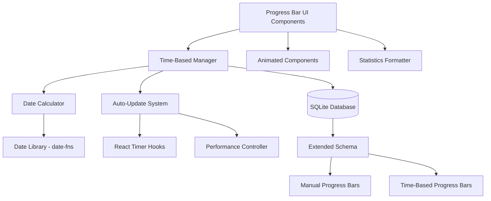

# Design Document: Time-Based Progress Bars

## Overview

The time-based progress bars feature extends the existing manual progress tracking system to support automatic time-based progression. This feature enables three distinct types of temporal tracking: count-up bars (from past to future dates), count-down bars (to future deadlines), and arrival date bars (tracking progress toward specific dates). The system automatically calculates and updates progress based on time passage, supporting large time scales and historical start dates while maintaining seamless integration with the existing SQLite database and React UI components.

The design leverages modern JavaScript date handling, efficient React hooks for real-time updates, and extends the current database schema to accommodate temporal data while preserving backward compatibility with existing manual progress bars.

## Time-Based Bar Types

The system supports three distinct time-based progress bar types, each optimized for different temporal tracking scenarios:

### Count-Up Bars
**Purpose**: Track progress from a historical start date toward a future target date.

**Use Cases**: Long-term goals that began in the past (e.g., "Days since project started", "Time in current role")

**Behavior**:
- Start date: Must be in the past (up to 10 years)
- Target date: Must be in the future
- Progress display: Elapsed time / Total duration
- Completion: Automatically marked complete when current date reaches target date

**Design Rationale**: Count-up bars address Requirement 1 by allowing users to track goals that began before creating the digital tracker, maintaining historical accuracy.

### Count-Down Bars
**Purpose**: Track remaining time until a future deadline.

**Use Cases**: Upcoming events, deadlines, milestones (e.g., "Days until launch", "Time until vacation")

**Behavior**:
- Start date: Implicitly set to current date at creation time
- Target date: Must be in the future
- Progress display: Remaining time / Total duration (inverted progress)
- Completion: Automatically marked complete when remaining time reaches zero

**Design Rationale**: Count-down bars address Requirement 2 by providing an intuitive deadline tracking mechanism with automatic start date handling.

### Arrival Date Bars
**Purpose**: Track progress toward a specific arrival date with configurable start.

**Use Cases**: Event planning, project milestones with defined start and end (e.g., "Conference preparation", "Product launch timeline")

**Behavior**:
- Start date: Configurable (past or present)
- Arrival date: Must be after start date
- Progress display: Elapsed time / Total duration
- Completion: Automatically marked complete when arrival date is reached
- Overdue status: Marked overdue if current date exceeds arrival date

**Design Rationale**: Arrival date bars address Requirement 3 by combining features of count-up and count-down bars with explicit overdue tracking for deadline-sensitive scenarios.

## Architecture

### System Components



### Data Flow

1. **Creation Flow**: User creates time-based bar → UI validates dates → Time-Based Manager calculates initial progress → Database stores temporal metadata
2. **Update Flow**: Timer triggers → Date Calculator computes current progress → UI components re-render with new values → Performance Controller manages update frequency
3. **Display Flow**: Database retrieves bars → Time-Based Manager identifies temporal bars → Date Calculator provides current values → UI renders with existing animated components

## Components and Interfaces

### Time-Based Progress Bar Manager

```typescript
interface TimeBasedProgressBar {
  id: string;
  title: string;
  description?: string;
  type: 'count-up' | 'count-down' | 'arrival-date';
  startDate: Date;
  targetDate: Date;
  createdAt: Date;
  updatedAt: Date;
  isCompleted: boolean;
  isOverdue?: boolean;
}

interface TimeBasedManager {
  createTimeBasedBar(config: TimeBasedBarConfig): Promise<TimeBasedProgressBar>;
  updateTimeBasedBar(id: string, updates: Partial<TimeBasedBarConfig>): Promise<TimeBasedProgressBar>;
  calculateCurrentProgress(bar: TimeBasedProgressBar): ProgressCalculation;
  getAllTimeBasedBars(): Promise<TimeBasedProgressBar[]>;
  markAsCompleted(id: string): Promise<void>;
}
```

### Date Calculator Service

```typescript
interface ProgressCalculation {
  currentValue: number;
  targetValue: number;
  percentage: number;
  elapsedTime: Duration;
  remainingTime: Duration;
  dailyProgressRate: number;
  estimatedCompletionDate?: Date;
  isCompleted: boolean;
  isOverdue: boolean;
}

interface ValidationResult {
  isValid: boolean;
  errors: ValidationError[];
}

interface ValidationError {
  field: string;
  message: string;
  code: 'INVALID_DATE_RANGE' | 'HISTORICAL_LIMIT_EXCEEDED' | 'FUTURE_START_DATE' | 'INVALID_DATE_FORMAT';
}

interface DateCalculator {
  calculateProgress(bar: TimeBasedProgressBar, currentDate: Date): ProgressCalculation;
  formatDuration(duration: Duration): string;
  validateDateRange(startDate: Date, targetDate: Date): ValidationResult;
  validateHistoricalDate(date: Date, maxYearsInPast: number): ValidationResult;
  validateFutureDate(date: Date): ValidationResult;
  getDurationInDays(startDate: Date, endDate: Date): number;
}
```

**Validation Rules** (addressing Requirements 1.3, 4.1, 4.4):
- **Date Range**: Target date must be after start date
- **Historical Limit**: Start dates can be up to 10 years in the past
- **Future Start Date**: Historical start dates cannot be in the future
- **Date Format**: All dates must be valid ISO 8601 format

**Design Rationale**: Explicit validation interfaces ensure clear error messages and consistent validation across all bar types, improving user experience and data integrity.

### Auto-Update System (Simplified)

Instead of a separate service class, auto-updates are handled directly in React hooks using the `useInterval` pattern. This approach:

- Eliminates coordination complexity between service and React lifecycle
- Leverages React's built-in state management
- Naturally integrates with Server Components (hooks are client-only)
- Is easier to test with Vitest fake timers

The previous design proposed:
```typescript
// ❌ Over-engineered for this use case
interface AutoUpdateSystem {
  startUpdating(bars: TimeBasedProgressBar[]): void;
  stopUpdating(): void;
  // ...
}
```

The simplified design uses hooks directly:
```typescript
// ✅ Simpler, React-idiomatic approach
useInterval(calculateProgress, isVisible ? 60_000 : null);
```

**When to add a service layer**: If future requirements need:
- Updates to continue when no component is mounted (unlikely for this app)
- Shared state across multiple React roots (unlikely)
- Web Worker offloading for heavy calculations (date math is trivial)

### React Hooks Integration

#### useInterval Hook (Dan Abramov Pattern)

Standard `setInterval` in `useEffect` suffers from stale closure issues. This pattern solves it:

```typescript
import { useEffect, useRef } from 'react';

/**
 * Declarative setInterval hook that avoids stale closure issues.
 * Pass null for delay to pause the interval.
 * Reference: https://overreacted.io/making-setinterval-declarative-with-react-hooks/
 */
export function useInterval(callback: () => void, delay: number | null) {
  const savedCallback = useRef(callback);

  // Remember the latest callback (avoids stale closures)
  useEffect(() => {
    savedCallback.current = callback;
  }, [callback]);

  // Set up the interval
  useEffect(() => {
    if (delay === null) return; // Paused

    const id = setInterval(() => savedCallback.current(), delay);
    return () => clearInterval(id);
  }, [delay]);
}
```

**Key benefits**:
- Callback always has access to current state/props
- `delay: null` pauses the interval (useful for tab visibility)
- Changing delay restarts the interval automatically
- Proper cleanup on unmount

#### useTimeBasedProgress Hook

```typescript
import { useState, useEffect } from 'react';
import { useInterval } from './useInterval';
import { dateCalculator } from '@/lib/services/DateCalculator';
import type { TimeBasedProgressBar, ProgressCalculation } from '@/lib/types';

const UPDATE_INTERVAL_MS = 60_000; // 1 minute

export function useTimeBasedProgress(bar: TimeBasedProgressBar) {
  const [progress, setProgress] = useState<ProgressCalculation | null>(null);
  const [isVisible, setIsVisible] = useState(true);

  // Calculate progress (client-side only to avoid hydration mismatch)
  const calculate = () => {
    setProgress(dateCalculator.calculateProgress(bar, new Date()));
  };

  // Initial calculation after hydration
  useEffect(() => {
    calculate();
  }, [bar.id, bar.startDate, bar.targetDate]);

  // Auto-update every minute (paused when tab hidden)
  useInterval(calculate, isVisible ? UPDATE_INTERVAL_MS : null);

  // Track tab visibility
  useEffect(() => {
    const handleVisibility = () => setIsVisible(!document.hidden);
    document.addEventListener('visibilitychange', handleVisibility);
    return () => document.removeEventListener('visibilitychange', handleVisibility);
  }, []);

  return {
    progress,
    isHydrated: progress !== null,
    refresh: calculate,
  };
}
```

#### useTimeBasedBars Hook (Batch Updates)

```typescript
export function useTimeBasedBars(bars: TimeBasedProgressBar[]) {
  const [progressMap, setProgressMap] = useState<Map<string, ProgressCalculation>>(new Map());
  const [isHydrated, setIsHydrated] = useState(false);
  const [isVisible, setIsVisible] = useState(true);

  const calculateAll = () => {
    const now = new Date();
    const newMap = new Map<string, ProgressCalculation>();
    for (const bar of bars) {
      newMap.set(bar.id, dateCalculator.calculateProgress(bar, now));
    }
    setProgressMap(newMap);
    setIsHydrated(true);
  };

  // Initial calculation
  useEffect(() => {
    calculateAll();
  }, [bars]);

  // Batch update all bars every minute
  useInterval(calculateAll, isVisible ? UPDATE_INTERVAL_MS : null);

  // Track visibility
  useEffect(() => {
    const handleVisibility = () => setIsVisible(!document.hidden);
    document.addEventListener('visibilitychange', handleVisibility);
    return () => document.removeEventListener('visibilitychange', handleVisibility);
  }, []);

  return { progressMap, isHydrated, refreshAll: calculateAll };
}
```

**Design Rationale**: This simplified approach eliminates the need for separate `AutoUpdateSystem`, `PerformanceController`, and `CalculationCache` classes. The hooks are self-contained, testable, and the date-fns calculations are fast enough (~0.01ms per bar) that caching is premature optimization.

## User Interface Components

### Progress Bar Creation Form

The creation form will be extended to support time-based progress bars while maintaining the existing manual bar creation flow:

**Design Decision**: Use a type selector as the first input to determine which fields to display, providing a clear and intuitive creation experience.

```typescript
interface CreateBarFormProps {
  onSubmit: (bar: ProgressBarConfig) => Promise<void>;
}

interface ProgressBarConfig {
  title: string;
  description?: string;
  barType: 'manual' | 'time-based';
  
  // Manual bar fields
  current?: number;
  target?: number;
  units?: string;
  
  // Time-based bar fields
  timeBasedType?: 'count-up' | 'count-down' | 'arrival-date';
  startDate?: Date;
  targetDate?: Date;
}
```

**Form Flow**:
1. User selects bar type (manual or time-based)
2. If time-based, user selects time-based type (count-up, count-down, arrival-date)
3. Form displays appropriate date pickers based on selection:
   - Count-up: start date (past) + target date (future)
   - Count-down: target date only (future)
   - Arrival-date: start date + arrival date (both configurable)
4. Form validates dates before submission

**Rationale**: This progressive disclosure approach reduces cognitive load by only showing relevant fields based on user selections, addressing Requirement 9.1.

### Progress Bar Display Components

Time-based progress bars will integrate with existing animated components while adding temporal-specific information:

```typescript
interface ProgressBarDisplayProps {
  bar: ProgressBar;
  progress?: ProgressCalculation;
  showStatistics?: boolean;
}
```

**Display Elements**:
- **Type Indicator**: Visual badge or icon distinguishing time-based from manual bars (Requirement 9.4)
- **Start Date Display**: For historical start dates, clearly show "Started: [date]" to indicate actual start (Requirement 4.5)
- **Progress Animation**: Reuse existing animated progress bar component (Requirement 9.2)
- **Time Statistics**: Display elapsed/remaining time in appropriate units (Requirement 7.1, 7.2)
- **Completion Status**: Show completion percentage and status badges (Requirement 7.3)
- **Daily Progress Rate**: Show calculated daily progress (Requirement 7.4)
- **Estimated Completion**: For count-up bars, show projected completion date (Requirement 7.5)

**Rationale**: Layering temporal information on top of existing components maintains UI consistency while providing rich time-based insights.

## Data Models

### Extended Database Schema

```sql
-- Extend existing progress_bars table
ALTER TABLE progress_bars ADD COLUMN bar_type TEXT DEFAULT 'manual' CHECK (bar_type IN ('manual', 'time-based'));
ALTER TABLE progress_bars ADD COLUMN start_date TEXT; -- ISO 8601 format
ALTER TABLE progress_bars ADD COLUMN target_date TEXT; -- ISO 8601 format
ALTER TABLE progress_bars ADD COLUMN time_based_type TEXT CHECK (time_based_type IN ('count-up', 'count-down', 'arrival-date'));
ALTER TABLE progress_bars ADD COLUMN is_completed BOOLEAN DEFAULT FALSE;
ALTER TABLE progress_bars ADD COLUMN is_overdue BOOLEAN DEFAULT FALSE;

-- Index for efficient time-based queries
CREATE INDEX idx_progress_bars_type ON progress_bars(bar_type);
CREATE INDEX idx_progress_bars_dates ON progress_bars(start_date, target_date) WHERE bar_type = 'time-based';
```

### TypeScript Data Models

```typescript
// Extended from existing ProgressBar interface
interface ProgressBar {
  id: string;
  title: string;
  description?: string;
  current: number; // For manual bars
  target: number;  // For manual bars
  units?: string;
  barType: 'manual' | 'time-based';
  
  // Time-based specific fields
  startDate?: Date;
  targetDate?: Date;
  timeBasedType?: 'count-up' | 'count-down' | 'arrival-date';
  isCompleted?: boolean;
  isOverdue?: boolean;
  
  createdAt: Date;
  updatedAt: Date;
}

// Duration representation
interface Duration {
  years: number;
  months: number;
  days: number;
  hours: number;
  minutes: number;
  totalDays: number;
  totalHours: number;
  totalMinutes: number;
}

// Statistics for display
interface ProgressStatistics {
  elapsedTime: Duration;
  remainingTime: Duration;
  completionPercentage: number;
  dailyProgressRate: number;
  estimatedCompletion?: Date;
  timeUntilCompletion?: Duration;
}
```

### Date Library Integration

The system will use `date-fns` for date calculations due to its:
- Lightweight, modular design (tree-shakeable)
- Immutable date handling
- Comprehensive duration and formatting functions
- Strong TypeScript support
- Better performance than Moment.js

```typescript
import {
  differenceInDays,
  differenceInHours,
  differenceInMinutes,
  format,
  isAfter,
  isBefore,
  parseISO,
  formatDuration,
  intervalToDuration
} from 'date-fns';
```

### Timezone Strategy

**Problem**: Server and client may be in different timezones, causing:
- Hydration mismatches when displaying times
- Incorrect progress calculations if server time != client time
- Off-by-one-day bugs at timezone boundaries

**Solution**: UTC-first approach with `@date-fns/utc`

```typescript
import { UTCDateMini } from '@date-fns/utc';
import { TZDate } from '@date-fns/tz';

// Storage: Always UTC ISO strings
const storedDate = new UTCDateMini().toISOString(); // "2026-01-24T12:00:00.000Z"

// Calculations: Always use UTCDateMini for consistency
const startDate = new UTCDateMini(bar.startDate);
const targetDate = new UTCDateMini(bar.targetDate);
const now = new UTCDateMini();
const elapsed = differenceInDays(now, startDate);

// Display: Convert to user's timezone only at render time
const userTimezone = Intl.DateTimeFormat().resolvedOptions().timeZone;
const displayDate = new TZDate(bar.targetDate, userTimezone);
const formatted = format(displayDate, 'PPP'); // "January 24, 2026"
```

**Rationale**:
- Server and client both calculate using UTC = identical results
- Only the display layer adapts to user's timezone
- Avoids "magic conversion bugs" described in date-fns-tz docs

### Hydration Strategy

**Problem**: Time-based progress differs between server render time and client hydration time, causing React hydration errors.

**Solution**: Client-only calculation with placeholder

```typescript
// ❌ BAD: Calculated during render - will mismatch
function ProgressBar({ bar }) {
  const progress = calculateProgress(bar, new Date()); // Different on server vs client!
  return <div>{progress.percentage}%</div>;
}

// ✅ GOOD: Calculate client-side only
function ProgressBar({ bar }) {
  const [progress, setProgress] = useState<ProgressCalculation | null>(null);

  useEffect(() => {
    // This only runs on client after hydration
    setProgress(calculateProgress(bar, new Date()));
  }, [bar]);

  if (!progress) {
    return <ProgressBarSkeleton />; // Server renders this
  }

  return <div>{progress.percentage}%</div>; // Client updates to this
}
```

**Alternative**: Use `suppressHydrationWarning` for minor time display differences where exact match doesn't matter:

```tsx
<time suppressHydrationWarning dateTime={date.toISOString()}>
  {formatRelative(date, new Date())}
</time>
```

**Rationale**: React 19 and Next.js 16 handle this pattern well. The brief flash of skeleton → actual value is acceptable UX for time-based content.

## Correctness Properties

*A property is a characteristic or behavior that should hold true across all valid executions of a system-essentially, a formal statement about what the system should do. Properties serve as the bridge between human-readable specifications and machine-verifiable correctness guarantees.*

### Property 1: Date Validation
*For any* date input in time-based progress bar creation, the system should accept past dates up to 10 years ago for start dates, future dates for target dates, and reject future dates when historical start dates are expected.
**Validates: Requirements 1.2, 2.1, 4.1, 4.4**

### Property 2: Date Range Validation  
*For any* pair of start and target dates, the system should validate that the target date occurs after the start date before allowing progress bar creation.
**Validates: Requirements 1.3, 3.2**

### Property 3: Time Calculation Accuracy
*For any* time-based progress bar with known start and target dates, the calculated elapsed time, remaining time, and total duration should accurately reflect the actual time differences using proper date arithmetic.
**Validates: Requirements 1.4, 1.5, 2.3, 3.3, 4.2, 4.3**

### Property 4: Completion and Overdue Status
*For any* time-based progress bar, when the current time reaches or exceeds the target date, the system should automatically mark it as completed, and when past the target date, mark arrival date bars as overdue.
**Validates: Requirements 2.5, 3.4, 3.5, 6.3**

### Property 5: Time Formatting Consistency
*For any* duration or time value displayed in the system, the formatting should use appropriate time units (years, months, days, hours, minutes) based on the magnitude and follow consistent formatting patterns.
**Validates: Requirements 5.2, 5.4, 7.1, 7.2**

### Property 6: Large Time Scale Support
*For any* time-based progress bar spanning up to 50 years, the system should maintain calculation accuracy across leap years and handle multi-year durations without precision loss.
**Validates: Requirements 5.1, 5.3, 5.5**

### Property 7: Auto-Update System Reliability
*For any* collection of time-based progress bars, the auto-update system should refresh all bars simultaneously every minute, recalculate values on page refresh, and resume accurate updates when browser tabs become active.
**Validates: Requirements 6.1, 6.2, 6.4, 6.5**

### Property 8: Progress Statistics Accuracy
*For any* time-based progress bar, the displayed completion percentage, daily progress rate, and estimated completion date should be mathematically consistent with the elapsed and remaining time calculations.
**Validates: Requirements 7.3, 7.4, 7.5**

### Property 9: Database Integration Compatibility
*For any* progress bar operation (create, read, update), the system should correctly handle both manual and time-based bars using the extended schema while preserving existing manual bar functionality.
**Validates: Requirements 8.1, 8.2, 8.3, 8.4, 8.5**

### Property 10: UI Component Integration
*For any* time-based progress bar display, the system should reuse existing animated components, clearly distinguish bar types, allow editing of time-based properties, and maintain formatting consistency with the existing unit system.
**Validates: Requirements 9.2, 9.3, 9.4, 9.5**

### Property 11: Performance Optimization
*For any* time-based progress bar system with multiple bars, the system should cache calculations to avoid redundant computation, update only visible bars, and properly clean up timers and event listeners to prevent memory leaks.
**Validates: Requirements 10.2, 10.3, 10.5**

## Error Handling

### Date Validation Errors
- **Invalid Date Range**: When target date is before start date, return clear validation error with suggested correction
- **Historical Date Limit**: When start date exceeds 10-year historical limit, provide specific error message with acceptable range
- **Future Start Date**: When historical start date is set in future, reject with explanation of historical date requirement

### Calculation Errors
- **Leap Year Handling**: Ensure February 29th calculations work correctly across leap year boundaries
- **Timezone Consistency**: Handle timezone changes and daylight saving time transitions gracefully
- **Large Duration Overflow**: Prevent integer overflow for very large time spans (50+ years)

### Auto-Update System Errors
- **Timer Cleanup**: Ensure all intervals are cleared when components unmount to prevent memory leaks
- **Batch Update Failures**: If batch updates fail, fall back to individual bar updates with error logging
- **Tab Visibility Recovery**: Handle cases where tab visibility API is not supported

## Performance Optimization Strategy

### When to Optimize

**Reality check**: For a personal progress tracking app with typically <100 bars:
- Date calculations with date-fns: ~0.01ms per bar
- 100 bars × 0.01ms = 1ms total per update cycle
- Updates occur once per minute

**Conclusion**: The baseline implementation is fast enough. Add optimization only if profiling shows actual issues.

### Built-in React 19 Optimizations

React 19 (used in this project) provides automatic optimizations:

1. **Automatic Batching**: Multiple `setState` calls in the same event/interval are batched into a single render
2. **Concurrent Rendering**: Large updates can be interrupted to keep UI responsive
3. **React Compiler**: Automatic memoization (enabled in this project via `next.config.ts`)

No manual `PerformanceController` or `requestAnimationFrame` batching needed.

### Tab Visibility (Implemented)

Pause updates when tab is hidden to save resources:

```typescript
// Already included in useTimeBasedProgress hook
useInterval(calculate, isVisible ? UPDATE_INTERVAL_MS : null);
```

### Future Optimizations (If Needed)

Only implement these if profiling shows performance issues:

**1. Intersection Observer for Visible-Only Updates**
```typescript
// Only calculate for bars currently in viewport
const [isInView, setIsInView] = useState(false);
const ref = useRef<HTMLDivElement>(null);

useEffect(() => {
  const observer = new IntersectionObserver(
    ([entry]) => setIsInView(entry.isIntersecting),
    { threshold: 0 }
  );
  if (ref.current) observer.observe(ref.current);
  return () => observer.disconnect();
}, []);

useInterval(calculate, isInView && isVisible ? UPDATE_INTERVAL_MS : null);
```

**2. Calculation Caching (Unlikely Needed)**
```typescript
// Only if the same bar's progress is calculated multiple times per minute
const cache = new Map<string, { minute: number; result: ProgressCalculation }>();

function getCachedProgress(bar: TimeBasedProgressBar): ProgressCalculation {
  const currentMinute = Math.floor(Date.now() / 60000);
  const cached = cache.get(bar.id);

  if (cached?.minute === currentMinute) {
    return cached.result;
  }

  const result = dateCalculator.calculateProgress(bar, new Date());
  cache.set(bar.id, { minute: currentMinute, result });
  return result;
}
```

**3. Web Worker (Overkill for Date Math)**
Only consider if calculations become CPU-intensive (e.g., complex statistics, ML predictions).

### Database Integration Errors
- **Schema Migration**: Provide rollback capability if schema extension fails
- **Data Type Conversion**: Handle conversion between manual and time-based bar types safely
- **Concurrent Updates**: Prevent race conditions when multiple processes update the same bar

## Testing Strategy

### Dual Testing Approach

The testing strategy employs both unit tests and property-based tests:

**Unit Tests** (Required):
- Specific examples of date calculations (e.g., New Year's Day to Christmas)
- Edge cases like leap years, month boundaries, DST transitions
- Error conditions and validation failures
- React hook lifecycle and cleanup
- Component rendering with mock data

**Property-Based Tests** (Recommended):
- Universal properties that hold for all valid inputs
- Mathematical relationships (elapsed + remaining = total)
- Validation logic across random inputs
- Helps find edge cases humans wouldn't think of

### Test Runner: Vitest

This project uses **Vitest** (not Jest). Key differences:

```typescript
// Vitest imports
import { describe, it, expect, vi, beforeEach, afterEach } from 'vitest';
import { renderHook, act } from '@testing-library/react';

// NOT: import { jest } from '@jest/globals';
// NOT: import { renderHook } from '@testing-library/react-hooks'; // DEPRECATED
```

### Timer Testing with Vitest

```typescript
import { vi, describe, it, expect, beforeEach, afterEach } from 'vitest';
import { renderHook, act } from '@testing-library/react';
import { useInterval } from './useInterval';

describe('useInterval', () => {
  beforeEach(() => {
    vi.useFakeTimers();
  });

  afterEach(() => {
    vi.useRealTimers();
  });

  it('calls callback at specified interval', () => {
    const callback = vi.fn();
    renderHook(() => useInterval(callback, 1000));

    expect(callback).not.toHaveBeenCalled();

    act(() => {
      vi.advanceTimersByTime(1000);
    });

    expect(callback).toHaveBeenCalledTimes(1);

    act(() => {
      vi.advanceTimersByTime(2000);
    });

    expect(callback).toHaveBeenCalledTimes(3);
  });

  it('pauses when delay is null', () => {
    const callback = vi.fn();
    const { rerender } = renderHook(
      ({ delay }) => useInterval(callback, delay),
      { initialProps: { delay: 1000 as number | null } }
    );

    act(() => {
      vi.advanceTimersByTime(1000);
    });
    expect(callback).toHaveBeenCalledTimes(1);

    rerender({ delay: null });

    act(() => {
      vi.advanceTimersByTime(5000);
    });
    expect(callback).toHaveBeenCalledTimes(1); // Still 1, paused
  });

  it('cleans up on unmount', () => {
    const callback = vi.fn();
    const { unmount } = renderHook(() => useInterval(callback, 1000));

    unmount();

    act(() => {
      vi.advanceTimersByTime(5000);
    });

    expect(callback).not.toHaveBeenCalled();
  });
});
```

### Property-Based Testing Strategy

The system employs both unit tests and property-based tests:

**Unit Tests** (Required):
- Specific examples of date calculations (e.g., New Year's Day to Christmas)
- Edge cases like leap years, month boundaries, DST transitions
- Error conditions and validation failures
- React hook lifecycle and cleanup
- Component rendering with mock data

**Property-Based Tests** (Recommended):
- Universal properties that hold for all valid inputs
- Mathematical relationships (elapsed + remaining = total)
- Validation logic across random inputs
- Helps find edge cases humans wouldn't think of

**CRITICAL**: Property tests must use constrained input generation to prevent non-deterministic failures and infinite durations. See [testing-guide.md](./testing-guide.md) for detailed constraints and templates.

### Testing Implementation Guidelines

- Property tests are **recommended but not blocking** for MVP
- Unit tests with specific examples are **required**
- Use `vi.fn()` for mocks (not `jest.fn()`)
- Use `vi.useFakeTimers()` and `vi.advanceTimersByTime()` for timers
- Use `renderHook` from `@testing-library/react` v13+ (not the deprecated standalone package)
- Test failures should provide clear counterexamples via fast-check's shrinking